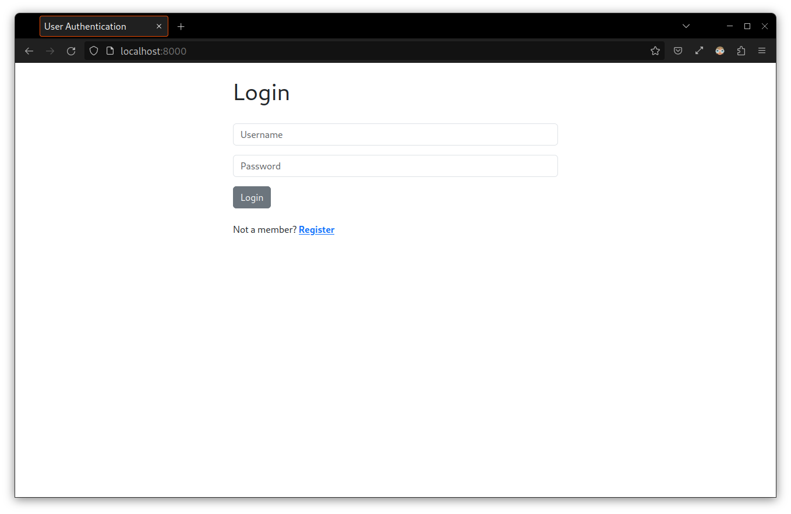
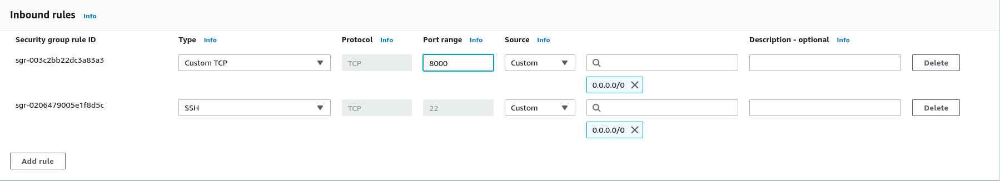
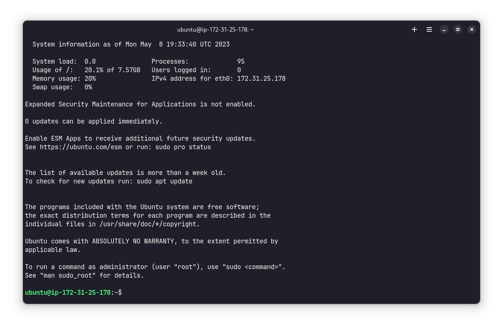
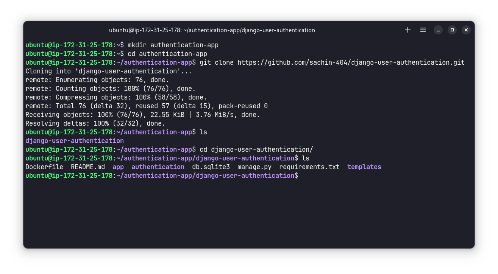
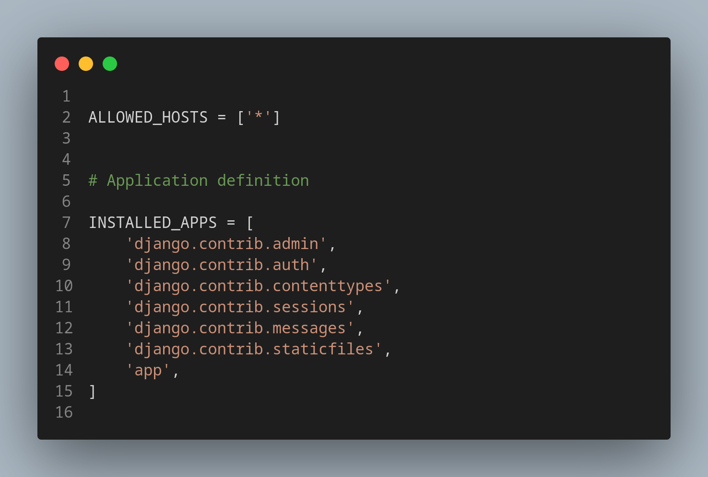

# Deploy Authentication App on AWS using Docker and Jenkins

In this project we are going to deploy a containerized django authentication app on AWS EC2 and then we will setup a CI-CD pipeline using Jenkins.

- We will be using [this repository](https://github.com/sachin-404/django-user-authentication)
- First we will build a docker image using the Dockerfile
- Deploy it on AWS
- Set up CI-CD pipeline using Jenkins

## 1. Run Locally
### A. Using github repository
Open terminal on your device and run the following command to clone the repository:
```
git clone https://github.com/sachin-404/django-user-authentication.git
```
Open the project in VS Code and set up virtual environment by running the following command
```
python3 -m venv venv
```
> NOTE: Use `python` instead of `python3` if you are using windows OS

Activate the virtual environment

- linux/mac: `source venv/bin/activate`
- windows: `venv/Scripts/activate`

Perform migrations by running the following commands:
```
python manage.py makemigrations
python manage.py migrate
```
Finally run the following command to start the server:
```
python3 manage.py runserver
```
Now enter `http://127.0.0.1:8000/` in browser and you will get to the homepage



### B. Using Docker Image
To run the app using docker image you should have Docker installed on your device.

First open the terminal on your device and pull the docker image using the following command:
```
docker pull sachin404/django-authentication
```

Run the following command to start the container:
```
docker run sachin404/django-authentication
```
Now go to the browser and enter  `http://localhost:8000/` you will get to the homepage of the app.

## 2. Set up EC2 Instance
Now that we have tested it locally, we will use the same steps to setup the project on AWS EC2 instance. 

Login to your AWS acoount and create an EC2 instance and connect with your terminal using SSH.

Before heading further go to EC2 dashboard > security groups > action > edit inbound rules and add custom TCP as following to allow traffic from everywhere.



Now connect to your terminal using SSH. It should look something like this



By now we have succesfully launched an EC2 instance and connected with the terminal. To countinue working with our project lets create a new directory and go to that directory by running the following commands:
```
mkdir authentication-app
cd authentication-app
```
Now clone the project repository by running the following command:
```
git clone https://github.com/sachin-404/django-user-authentication.git
```
Run `cd django-user-authentication` to go to the project directory. Run `ls` command to see the files.



Now we will modify `settings.py` file so that all IPs are allowed. For that run `nano authentication/settings.py` to open the file. Look for `ALLOWED_HOSTS=[]` and change it to `ALLOWED_HOSTS = ['*']` as following



By now we have succesfully set up our project on EC2 Instance.


