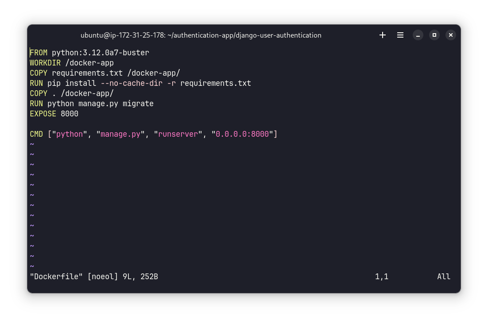
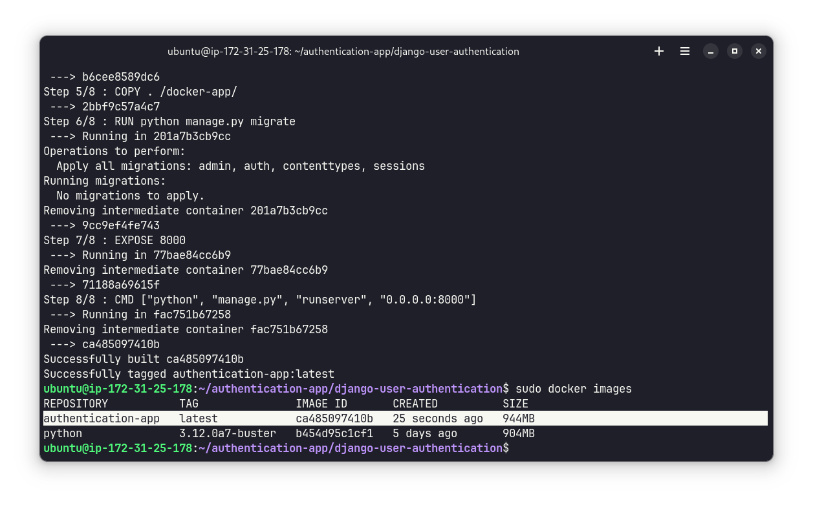
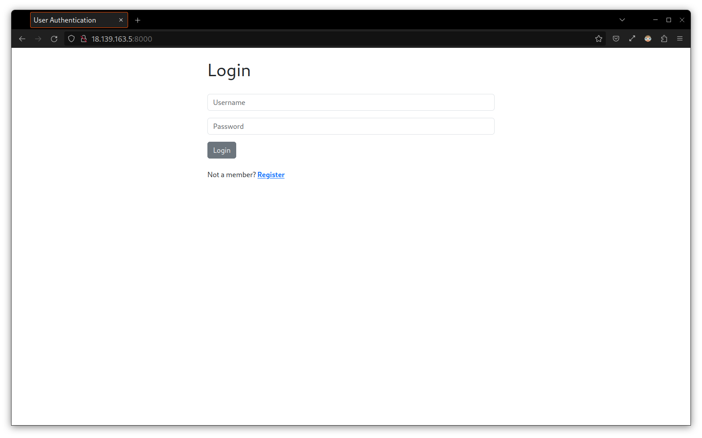
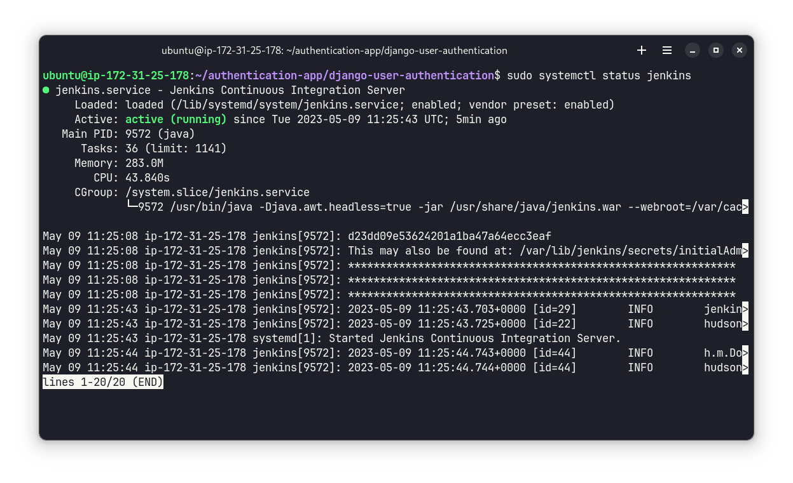
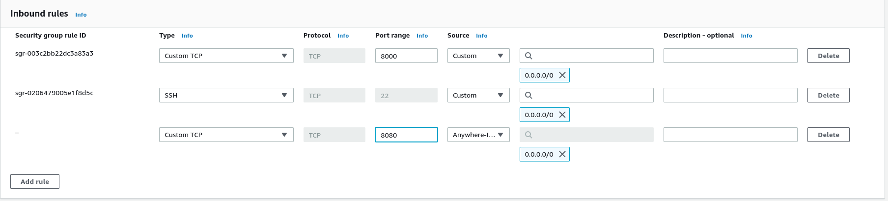
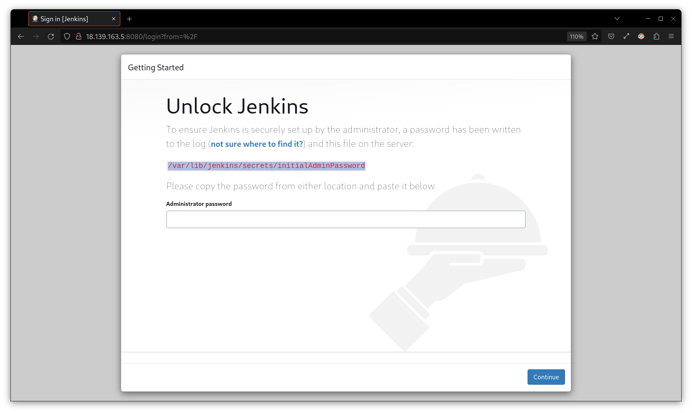
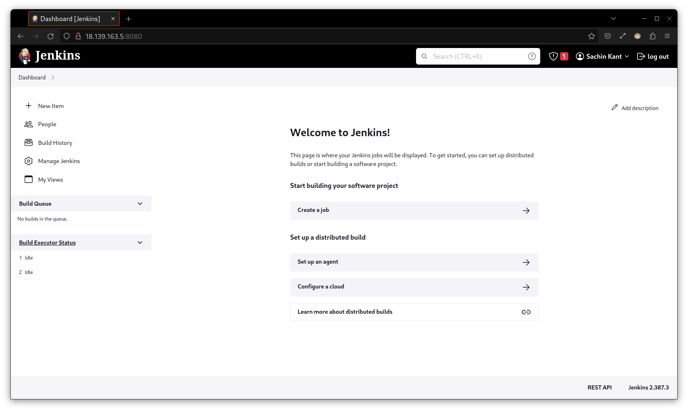
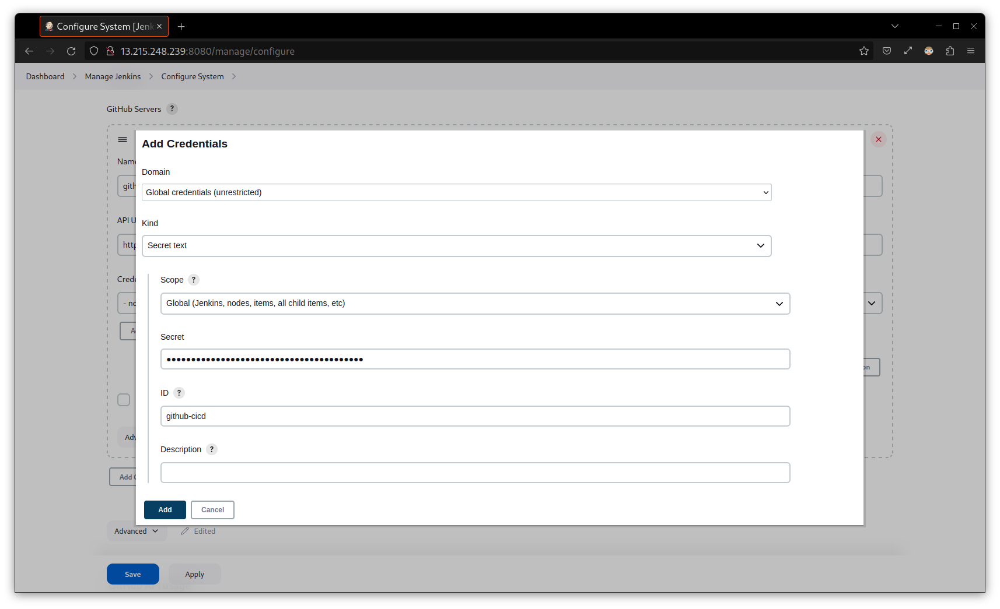

# Deploy Authentication App on AWS using Docker and Jenkins

In this project we are going to deploy a containerized django authentication app on AWS EC2 and then we will setup a CI-CD pipeline using Jenkins.

- We will be using [this repository](https://github.com/sachin-404/django-user-authentication)
- First we will build a docker image using the Dockerfile
- Deploy it on AWS
- Set up CI-CD pipeline using Jenkins

## 1. Run Locally
### A. Using github repository
Open terminal on your device and run the following command to clone the repository:
```
git clone https://github.com/sachin-404/django-user-authentication.git
```
Open the project in VS Code and set up virtual environment by running the following command
```
python3 -m venv venv
```
> NOTE: Use `python` instead of `python3` if you are using windows OS

Activate the virtual environment

- linux/mac: `source venv/bin/activate`
- windows: `venv/Scripts/activate`

Perform migrations by running the following commands:
```
python manage.py makemigrations
python manage.py migrate
```
Finally run the following command to start the server:
```
python3 manage.py runserver
```
Now enter `http://127.0.0.1:8000/` in browser and you will get to the homepage


### B. Using Docker Image
To run the app using docker image you should have Docker installed on your device.

First open the terminal on your device and pull the docker image using the following command:
```
docker pull sachin404/django-authentication
```

Run the following command to start the container:
```
docker run sachin404/django-authentication
```
Now go to the browser and enter  `http://localhost:8000/` you will get to the homepage of the app.

## 2. Set up EC2 Instance
Now that we have tested it locally, we will use the same steps to setup the project on AWS EC2 instance. 

Login to your AWS acoount and create an EC2 instance and connect with your terminal using SSH.

Before heading further go to EC2 dashboard > security groups > action > edit inbound rules and add custom TCP as following to allow traffic from everywhere.


Now connect to your terminal using SSH. It should look something like this


By now we have succesfully launched an EC2 instance and connected with the terminal. To countinue working with our project lets create a new directory and go to that directory by running the following commands:
```
mkdir authentication-app
cd authentication-app
```
Now clone the project repository by running the following command:
```
git clone https://github.com/sachin-404/django-user-authentication.git
```
Run `cd django-user-authentication` to go to the project directory. Run `ls` command to see the files.


Now we will modify `settings.py` file so that all IPs are allowed. For that run `nano authentication/settings.py` to open the file. Look for `ALLOWED_HOSTS=[]` and change it to `ALLOWED_HOSTS = ['*']` as following


By now we have succesfully set up our project on EC2 Instance.

## 3. Set up Docker

- Install Docker by running the following command
```
sudo apt install docker.io
```
- After the Docker is succesfully installed we will use Dockerfile to create a docker image and run the app as a docker container.

- Dockerfile is already created, you can view it by running the following command
```
vi Dockerfile
```


- Build the docker image by running the following command
```
sudo docker build -t authentication-app .
```

- Run `sudo docker images` after the build is completed to check the built image.



- Now run the following command to run the docker container
```
sudo docker run -p 8000:8000 authentication-app
```

- Now go to your EC2 instance and copy public IP address. Go open your browser and go to `<Public-IP>:8000`. Replace `<PublicIP>` with the IP address of your instance. For example it is `18.139.163.5:8000`. 



By now we have built docker image and run our containerized app on EC2 instance. In the next part we will set up CI-CD pipeline for our project using Jenkins.

## 4. Install and set up Jenkins
- update your system by running the following commands
```
sudo apt update
suod apt upgrade
```
- install Java
```
sudo apt install openjdk-11-jre 
```
- Run following commands to install Jenkins
```
wget -q -O - https://pkg.jenkins.io/debian-stable/jenkins.io.key |sudo gpg --dearmor -o /usr/share/keyrings/jenkins.gpg
```
```
sudo sh -c 'echo deb [signed-by=/usr/share/keyrings/jenkins.gpg] http://pkg.jenkins.io/debian-stable binary/ > /etc/apt/sources.list.d/jenkins.list'
```
```
sudo apt update
```
```
sudo apt install jenkins
```
- Start Jenkins
```
sudo systemctl start jenkins
```
```
sudo systemctl status jenkins
```

If everything goes well the output will be something like this


- Before heading further add port 8080 to inbound rules in security groups similar to we did for port 8000



- Now open jenkins in browser on port 8080
- when you open for the first time it will ask for password. Run `sudo cat /var/lib/jenkins/secrets/initialAdminPassword` to get the key.



- install suggested plugins and follow instructions to set up the admin user. After the setup is done the homepage should look like this



By now Jenkins is successfully installed and configured.Next we will set up gihub repository with jenkins.

## 5. Integrate GitHub with Jenkins

### create github personal access token
- go to github > settings > developer settings > personal access token > create new token
- name it anything you want and check **repo** and **workflow** fields and click on generate token
- make sure to copy your token and keep it somewhere safe as you will not be seeing it again

### push code to github
- to set up a cicd pipeline you first need to push code to github. For that create a new repository and name it anything you want. Once created copy the url
- Go to your terminal (make sure it is connected to the EC2 instance and you are in the root directory of the project) and run the following command
```
git remote set-url origin <your repo url>
```
here replace `<your repo url>` with the url of your created repository

- Now run all the necessary add, commit and push command. When asked for username and password, enter your github username and for password enter the personal access token you just created

### Integrate Jenkins with github
- Open jenkins on your browser
- Go to Manage Jenkins > Configure System > Scroll down to GitHub > click on add github server
- Fill all the necessary fields and in place of credentials, add new credentials
- A new pop up menu will open for adding the credentials. In the **Kind** drop down menu select **secret text**. In the **Secret** field enter the github personal access token and give it any name in the ID section 



- Add the credentials and select it. Now click on **Test connection** button to test it.
- Save it and now you have successfully integrated jenkins with github.
